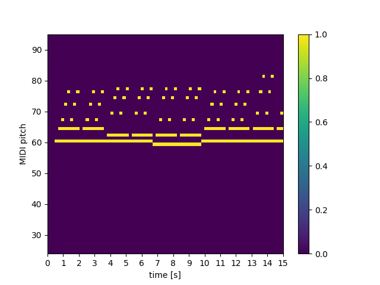
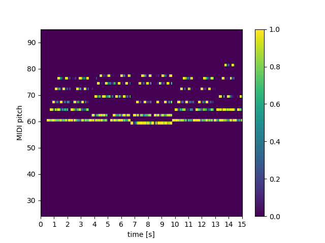
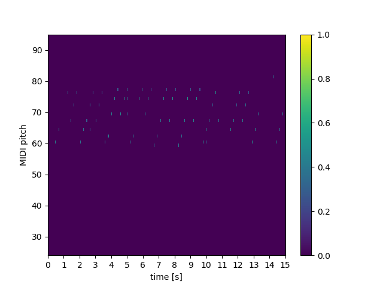

<link href="style.css" rel="stylesheet">

# Overview
We propose a model to improve automatic music transcription by adding a perceptual objective using differentiable rendering, 
while permitting automatic timbre-based arrangement to different musical instruments from the original.

# Transcription

## Bach - Prelude in C Major, BWV 846

|Original data|Transcription|
|:-:|:-:|
|Input waveform <audio controls><source src="data/transcription/test_MAPS_MUS-bach_846_AkPnBcht_org.wav"></audio>||
|GT piano-roll |Predicted piano-roll |
||Predicted onset matrix |
|Rendered from GT piano-roll <audio controls><source src="data/transcription/test_MAPS_MUS-bach_846_AkPnBcht_gt.wav"></audio>|Rendered from predicted piano-roll <audio controls><source src="data/transcription/test_MAPS_MUS-bach_846_AkPnBcht.wav"></audio>|

# Arrangement

## Orchestra to strings (Dvorak - Symphony No.9 Fourth movement)
The sounds of strings are stationary.

|Original sound|Arrangement|
|:-:|:-:|
| <audio controls><source src="data/arrangement/dvorak_original_orchestra.wav"></audio>| <audio controls><source src="data/arrangement/dvorak_generated_strings.wav"></audio>|

## Orchestra to organ (Holst - The Planets, Jupiter)
The sound of a organ is stationary.

|Original sound|Arrangement|
|:-:|:-:|
| <audio controls><source src="data/arrangement/jupiter_original_orchestra.wav"></audio>| <audio controls><source src="data/arrangement/jupiter_generated_organ.wav"></audio>|

## Orchestra to piano (Haydn - Menuet)
The sound of a piano is non-stationary.

|Original sound|Arrangement|
|:-:|:-:|
| <audio controls><source src="data/arrangement/haydn_original_orchestra.wav"></audio>| <audio controls><source src="data/arrangement/haydn_generated_piano.wav"></audio>|
